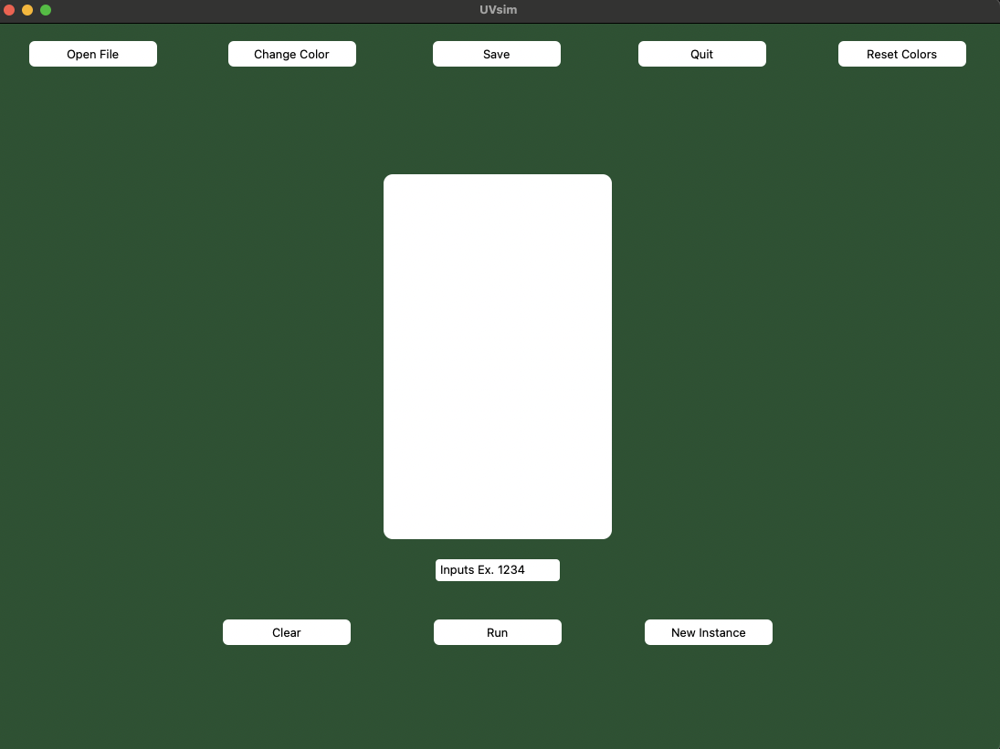
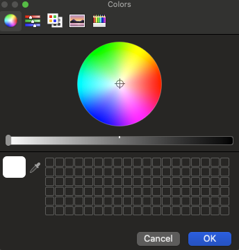
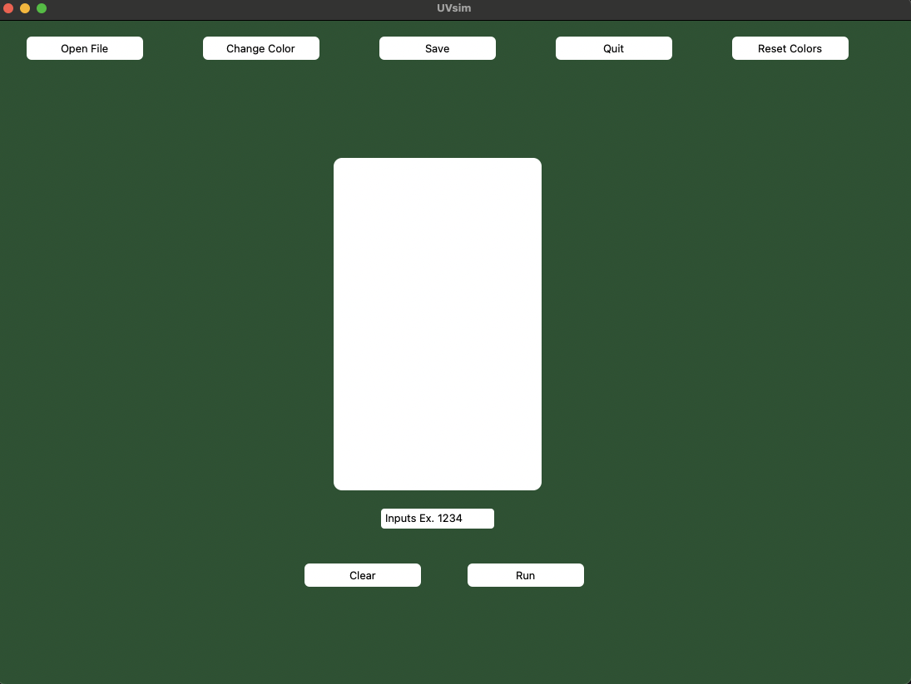

This program is a python program and assumes you use it from VS Code.
In order to launch the GUI from the command line enter: pip install tkinter.
Then from the command line enter: pip install customtkinter.
In order to launch the application from the command line enter: 'py -m main' or 'python3 main.py' (without quotation marks).

Once you run main.py in the terminal you will the main gui window open up. Below is a screenshot of what the main gui looks like.

 

 <b>Open File</b>: This button lets you access any file you have in your computer. You click on this button and you are able to search through your directories.
Please keep in mind you are only able to access .txt files. Along with that you can only have 250 lines of commands in the text file. You are also only limited 
to your file having either 6 digit or 4 digit commands. You are not able to have both in the same file, however we support files that have only 6 digit commands
or only 4 digit commands. 

<b>Change Color</b>: This button lets you change the color of the GUI. You will be prompted with a color wheel that you can use to pick your colors. The color 
wheel will appear twice, once to set the primary color (background color) then to set the secondary color(color of buttons). <em>Once you open the color wheel, you must
pick a color, choosing to exit the color wheels (primary or secondary) without picking a color sets the values to null and crashes the project.</em> <b>A fix will be provided
at the end of the page</b>. You simply have to copy and paste this in settings.json file. There will be an image below of what it will look like. 

<b>Save</b>: This button allows you to save the file currently as is, or you can save it as a different file. It also allows you to choose where you want to save it. If
you make changes to a file and want the program to run your new changes; you'll want to save the changes then hit the clear button, finally you'll open the file again to 
run your new changes. 

<b>Quit</b>: This button will quit out the instance that you are actively using 

<b>Reset Colors</b>: This button will reset the colors back to the UVU combo. Forest green primary with a white secondary. 

<b>Clear</b>: This button will clear the text in the input file. If you run a file and then want to run another, you will hit this clear button first and the open your next file

<b>Run</b>: This button runs the program. 

<b>New Instance</b>: This button will create a separate window that runs everything the same, however this new instance does not have the new instance button itself. The reason for this
is to not cause any bugs and also to help differentiate between the main instance and secondary instances. All functions work here just like the primary instance, however if you change the color in a new instance, it will not change it in the parent instance, only for the future children instances. If you quit the parent/main instance, it will close all other instances. You are able to run as many insntances as you would like. An image below will show how the new instance window looks. 

<b>Input Box</b>: This is the input box where you will enter input if needed. If you are unsure if input is needed, hit the run button, if input is needed then a popup will appear. If
you have a 4 digit file you can only enter 4 digit inputs, or you will get an error. If you have a 6 digit file then the input box will only accept 6 digit inputs (ex: 123456,789011). Any type of input that is not the same as its respected file, will cause an error.

<b>Text Box</b>: This text box can be used to add new entries on the fly. Or maybe you want to remove some entries. Simply click into it and remove or add to your liking. After editing it, you will want to hit the save button, then the clear button, then open the file again. If you do not follow these steps, then the program will not execute your new commands 

The following is the allotted operations:

I/O operation:
READ = 10 Read a word from the keyboard into a specific location in memory.
WRITE = 11 Write a word from a specific location in memory to screen.

Load/store operations:
LOAD = 20 Load a word from a specific location in memory into the accumulator.
STORE = 21 Store a word from the accumulator into a specific location in memory.

Arithmetic operation:
ADD = 30 Add a word from a specific location in memory to the word in the accumulator (leave the result in the accumulator)
SUBTRACT = 31 Subtract a word from a specific location in memory from the word in the accumulator (leave the result in the accumulator)
DIVIDE = 32 Divide the word in the accumulator by a word from a specific location in memory (leave the result in the accumulator).
MULTIPLY = 33 multiply a word from a specific location in memory to the word in the accumulator (leave the result in the accumulator).

Control operation:
BRANCH = 40 Branch to a specific location in memory
BRANCHNEG = 41 Branch to a specific location in memory if the accumulator is negative.
BRANCHZERO = 42 Branch to a specific location in memory if the accumulator is zero.
HALT = 43 Stop the program

As the program reads the file it will follow the instructions from the file. 
At the end it will print the outputs, the resulting memory and the accumulator or give a reason as to why it wasn't able to complete the instructions in the file.

